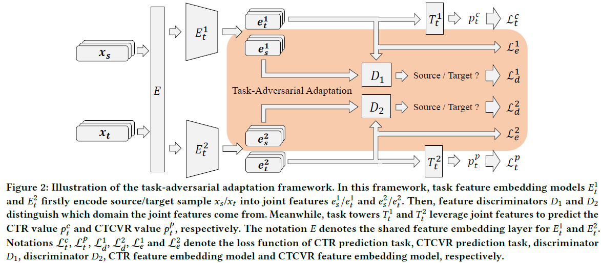

# Task-Adversarial Adaptation for Multi-modal Recommendation in PyTorch

Hongzu Su, Jingjing Li, Fengling Li, Lei Zhu, Ke Lu, Yang Yang



Abstract: An ideal multi-modal recommendation system is supposed to be timely updated with the latest modality information and interaction data because the distribution discrepancy between new data and historical data will lead to severe recommendation performance deterioration. However, upgrading a recommendation system with numerous new data consumes much time and computing resources. To mitigate this problem, we propose a Task-Adversarial Adapta-tion (TAA) framework, which is able to align data distributions and reduce resource consumption at the same time. This framework is specifically designed to align distributions of embedded features for different recommendation tasks between the source domain (i.e., historical data) and the target domain (i.e., new data). Tech-nically, we design a domain feature discriminator for each task to distinguish which domain a feature comes from. By the two-player min-max game between the feature discriminator and the feature embedding network, the feature embedding network is able to align the source and target data distributions. With the ability to align source and target distributions, we are able to reduce the number of training samples by random sampling. In addition, we formulate the proposed approach as a plug-and-play module to accelerate the model training and improve the performance of mainstream multi-modal multi-task recommendation systems. We evaluate our method by predicting the Click-Through Rate (CTR) in e-commerce scenarios. Extensive experiments verify that our method is able to significantly improve prediction performance and accelerate model training on the target domain. For instance, our method is able to surpass the previous state-of-the-art method by 2.45%in terms of Area Under Curve (AUC) on AliExpress_US dataset while only utilizing one percent of the target data in training.

## Datasets

* AliExpressDataset: This is a dataset gathered from real-world traffic logs of the search system in AliExpress. This dataset is collected from 5 countries: Russia, Spain, French, Netherlands, and America, which can utilized as 5 multi-task datasets. We are unable to provide the processed dataset for copyright reasons, therefore please download the dataset from the original website. [Original_dataset](https://tianchi.aliyun.com/dataset/dataDetail?dataId=74690). 

  You can put the downloaded '.zip' files in `./data/` and run `python preprocess.py --dataset_name NL` to process the dataset.

## Preparations

- We provide the pre-trained source models for each method. These methods are pretrained with two NVIDIA RTX 3090s. You can also put your pre-trained models in `./chkpt_src`.
- You can use `make_splits.py` to randomly select target training samples. Selecting samples before training and selecting samples during training yields similar results.


## Requirements

* Python 3.6
* PyTorch > 1.10
* pandas
* numpy
* tqdm

## Run

You can run a model through:

```bash
python main.py --model_name AITM --tgt_dataset_name AliExpress_NL
```

## Acknowledgement

The structure of this code is largely based on [MTReclib](https://github.com/easezyc/Multitask-Recommendation-Library). Thanks for their work.
